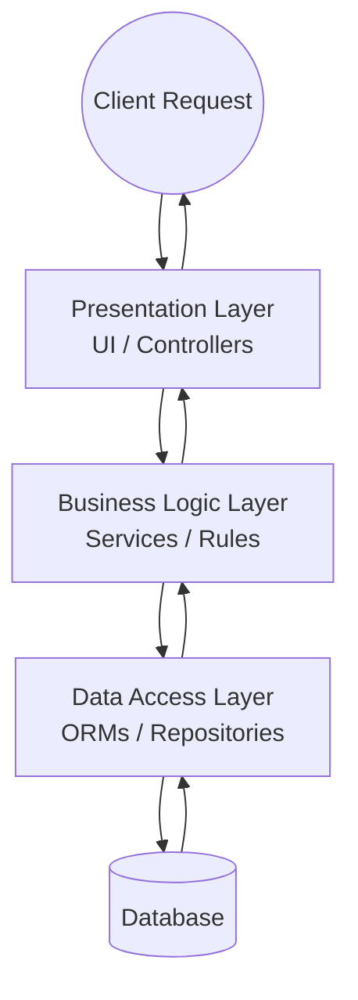
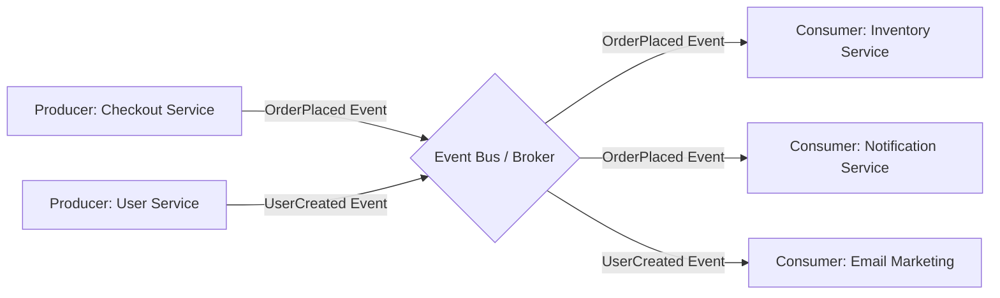
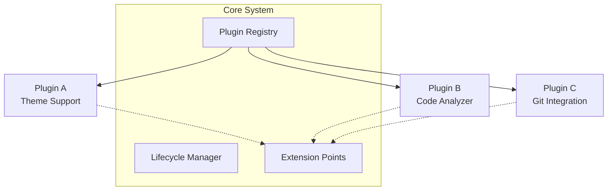
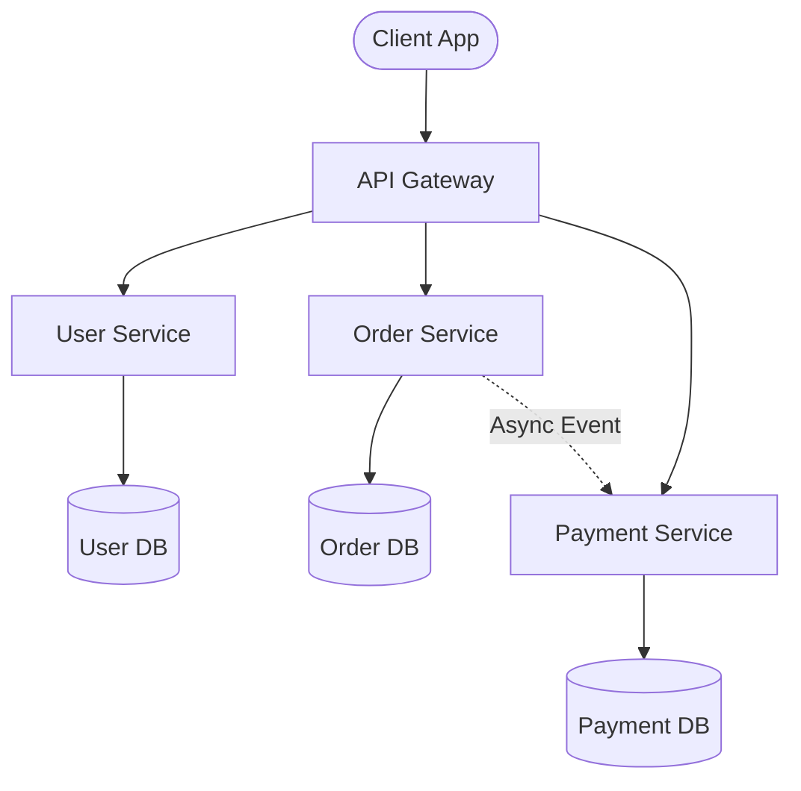
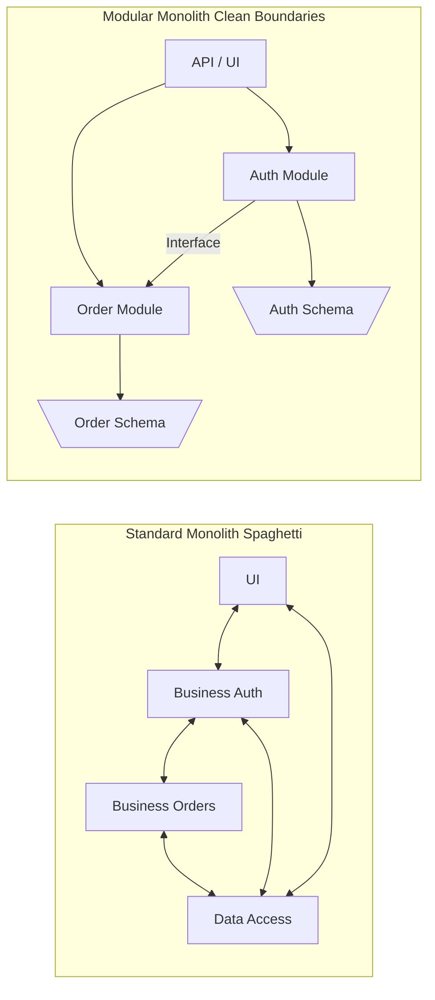

# Architectural Patterns

Choosing the right architectural pattern is a critical decision in system design. It defines how components interact, how data flows, and how the system scales over time. In this chapter, we will explore five fundamental architectural patterns in detail.

## 1. Layered (N-Tier) Architecture

The Layered (or N-Tier) architecture organizes components into horizontal logical layers. A request typically enters through the top layer and works its way down, with each layer having a specific responsibility. 

### Core Concepts
- **Presentation Layer**: Handles UI and user interaction.
- **Business Logic Layer**: Contains the core business rules and processing.
- **Data Access Layer**: Manages communication with the database or external storage.
- **Database Layer**: The actual data storage.

### Diagram

### Pros and Cons
**Advantages**:
- **Separation of Concerns**: Each layer has a distinct responsibility.
- **Ease of testing**: Layers can be tested independently (e.g., mocking the data access layer).
- **Simplicity**: Very natural way to build many standard business applications.

**Disadvantages**:
- **Monolithic deployments**: Usually deployed as a single unit.
- **Performance**: A user request must pass through multiple layers, which can add overhead.

---

## 2. Event-Driven Architecture

In this model, components are highly decoupled. Instead of calling each other directly (synchronously), they communicate by producing and consuming events through a central mediator or event bus.

### Core Concepts
- **Event Producers**: Components that generate and publish events when a state changes.
- **Event Bus / Broker**: The intermediary message router (e.g., Kafka, RabbitMQ) that accepts events and routes them to interested parties.
- **Event Consumers**: Components that listen for specific events and react accordingly.

### Diagram

### Pros and Cons
**Advantages**:
- **High Decoupling**: Producers and consumers don't need to know about each other.
- **Scalability**: Can easily scale consumers independently to handle high event loads.
- **Extensibility**: New consumers can be added without modifying producers.

**Disadvantages**:
- **Complexity**: Harder to reason about system flow and track down errors.
- **Eventual Consistency**: Data might not be updated instantaneously across all services.
- **Error Handling**: Requires complex mechanisms like dead-letter queues for failed events.

---

## 3. Microkernel (Plug-in) Architecture

This pattern consists of a "Core System" that provides minimal functionality required to run the application, along with independent "Plug-in modules" that add specific, specialized features.

### Core Concepts
- **Core System**: Manages the application lifecycle, plugin registration, and basic operations.
- **Plug-in Modules**: Standalone, independent components that provide extended functionality.
- **Plugin Registry**: How the core system knows which plugins are available and how to execute them.

*Commonly seen in applications like VS Code, Eclipse, or web browsers.*

### Diagram

### Pros and Cons
**Advantages**:
- **Extensibility**: Extremely easy to add new features without changing the core system.
- **Customization**: Users can tailor the application by installing only the plugins they need.
- **Isolation**: Plugins can be developed and updated independently by different teams or third parties.

**Disadvantages**:
- **Complexity in Core Design**: The core system must be carefully designed to support flexible extension points.
- **Performance**: Heavy reliance on plugins can slow down the core system (e.g., too many browser extensions).

---

## 4. Microservices Architecture

Unlike a monolith, the microservices pattern treats the application as a suite of small, independently deployable services. Each service typically runs in its own process, achieves a specific business goal, and owns its own database to ensure loose coupling.

### Core Concepts
- **Independent Services**: Modeled around business domains (e.g., Orders, Users, Payments).
- **API Gateway**: A single entry point that routes client requests to the appropriate microservices.
- **Decentralized Data**: Each service manages its own database schema.

### Diagram

### Pros and Cons
**Advantages**:
- **Independent Deployments**: Teams can update small parts of the system without redeploying everything.
- **Technology Diversity**: Different services can be written in different languages (Polyglot).
- **Fault Isolation**: A crash in one service generally doesn't bring down the entire system.

**Disadvantages**:
- **Operational Complexity**: Requires robust orchestration (e.g., Kubernetes), logging, and monitoring.
- **Distributed Data**: Makes maintaining data consistency and distributed transactions very challenging.
- **Network Latency**: Inter-service communication relies on the network, leading to potential latency and failure points.

---

## 5. Monolithic vs. Modular Monolith

While microservices are popular, monoliths still have a strong place. The key distinction to understand is between a traditional (sometimes messy) monolith and a cleanly structured **Modular Monolith**.

### Core Concepts
- **Standard Monolith**: A single deployment unit where code might easily become intertwined. A change in one area can inadvertently affect another because boundaries are not enforced.
- **Modular Monolith**: Still a single deployment unit (one process, one repository), but the code is strictly separated into independent modules. Modules communicate through well-defined interfaces, much like microservices, but without the network overhead.

### Diagram

### Differences at a Glance

| Feature | Standard Monolith | Modular Monolith |
|---------|-------------------|------------------|
| **Boundaries** | Weak or non-existent (Spaghetti code) | Strict, enforced by rules or packaging |
| **Inter-module Calls**| Direct class/method references everywhere | Through defined public interfaces (APIs) |
| **Data Ownership** | Unrestricted access to any table | Each module manages its own tables/schema|
| **Refactoring to Microservices**| Very difficult | Relatively straightforward |

**Why Modular Monoliths?**
They offer the best of both worlds for many mid-sized projects: you get the simplicity of a single deployment and simple local method calls, but you retain the clean separation of concerns required to scale the team and eventually split out microservices if truly necessary.
