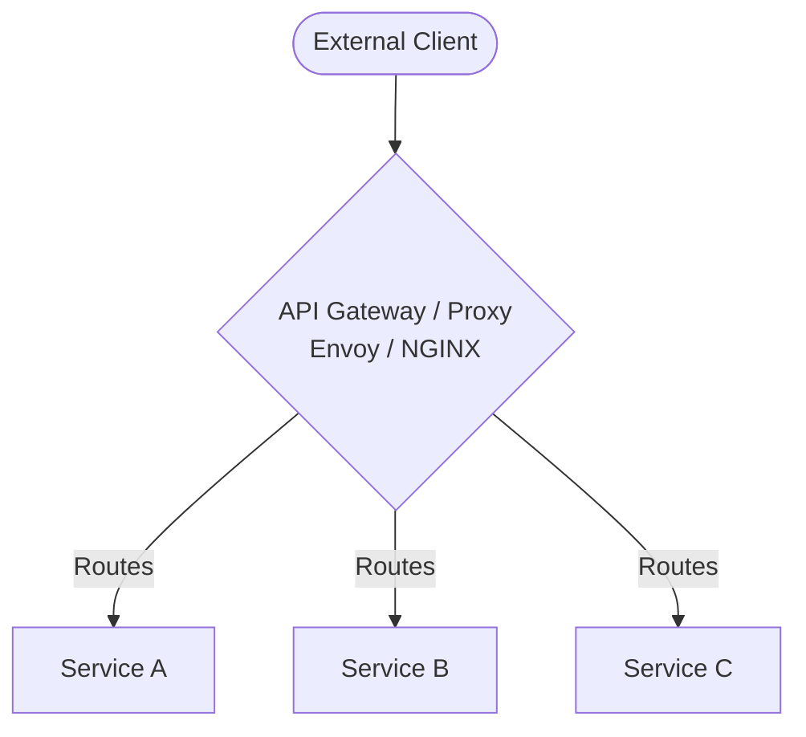
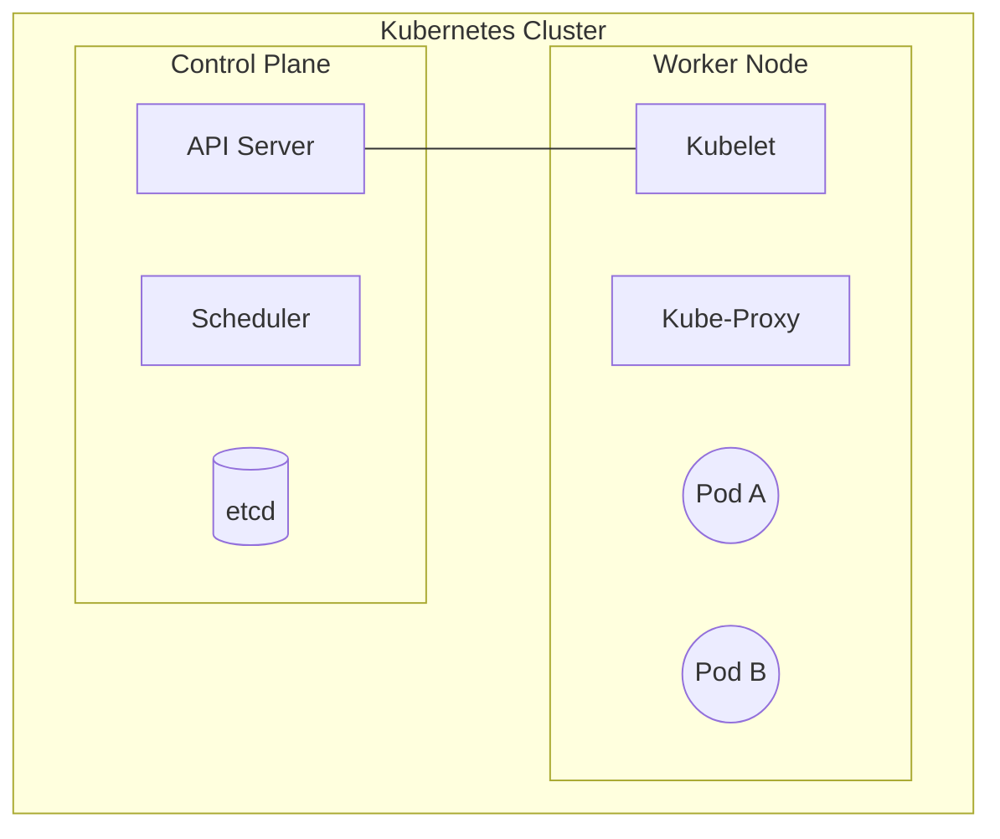
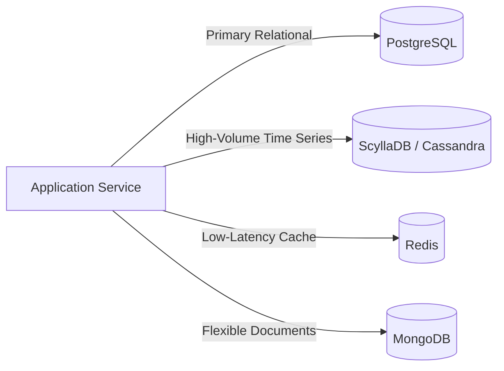
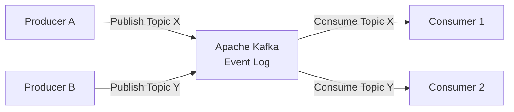
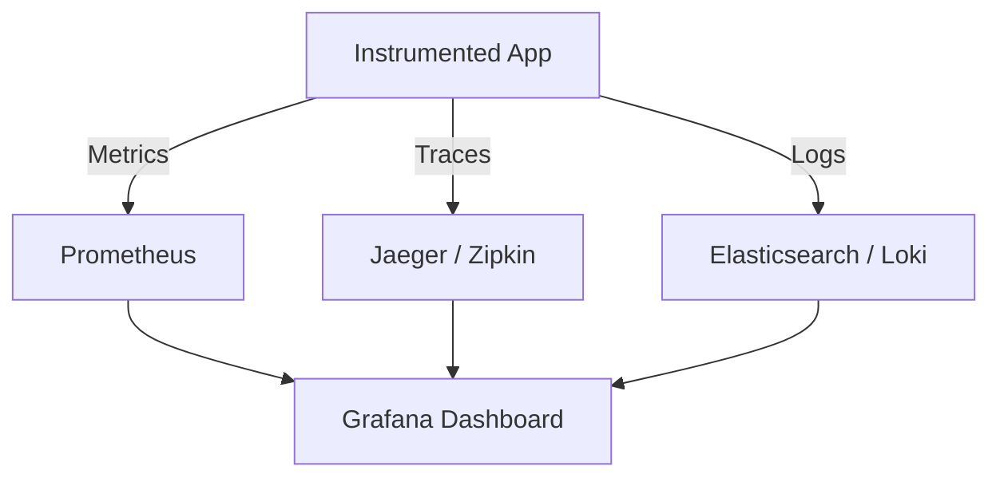
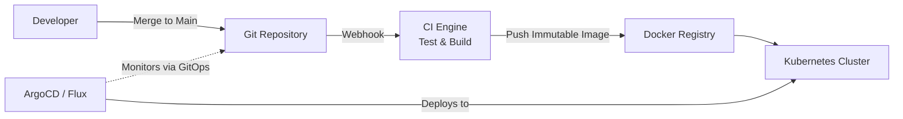
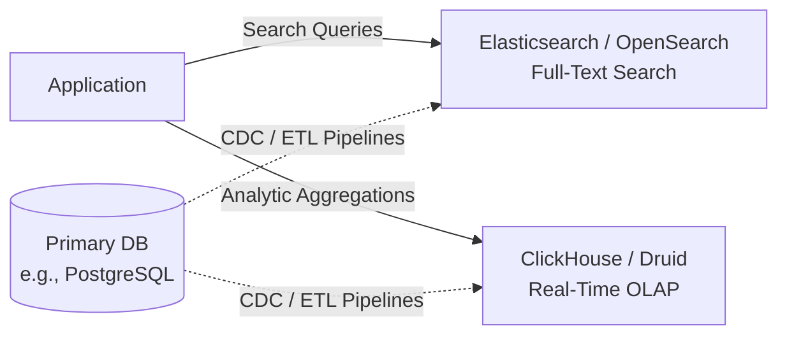
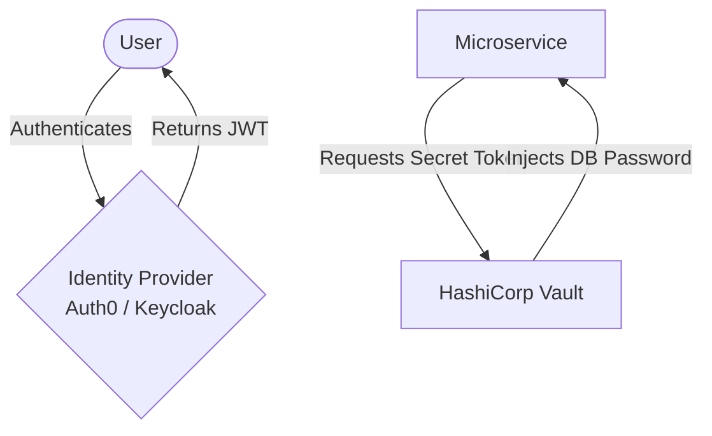
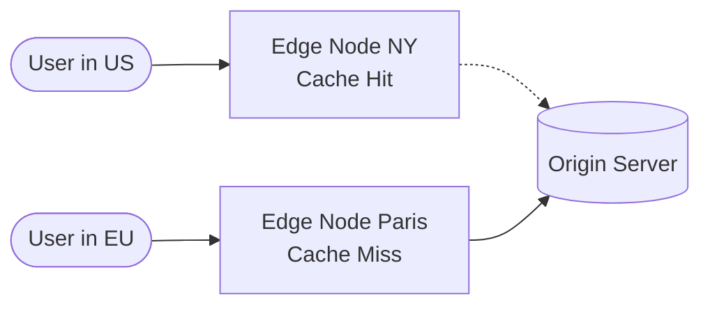

# Modern System Infrastructure Tools

This chapter provides a comprehensive review of the essential tools and platforms utilized in modern, scalable system architectures. As the industry transitions from traditional monolithic deployments to distributed, cloud-native microservices, the tooling ecosystem has evolved to prioritize orchestration, observability, and robust data management.

## 1. Gateway and Proxy Layer

The gateway layer serves as the primary ingress point for external traffic, managing routing, load balancing, and proxying to backend services. It abstracts internal network complexities from the public internet.

### NGINX
**Overview:** NGINX is a deterministic, event-driven web server, reverse proxy, and load balancer. Historically the industry standard for serving static content and terminating SSL/TLS connections, it remains ubiquitous in mid-to-large-scale architectures due to its high conceptual maturity.
**Strategic Use:** Best deployed as an edge proxy, HTTP cache, or secure public-facing ingress controller where raw throughput and a minimal memory footprint are required.

### Envoy Proxy
**Overview:** Originally developed by Lyft, Envoy is an L7 proxy and communication bus designed specifically for large, modern service-oriented architectures. Written in C++, it has become the foundational data plane for most modern Service Meshes (such as Istio).
**Strategic Use:** Envoy excels in decentralized environments where services require robust health checking, advanced load balancing architectures, and deep observability (metrics and distributed tracing) natively at the network layer.

### HAProxy
**Overview:** High Availability Proxy (HAProxy) is widely recognized in the enterprise networking space for its robust L4 (TCP) and L7 (HTTP) load balancing capabilities. 
**Strategic Use:** Frequently utilized in infrastructure environments requiring mathematically precise load balancing algorithms and extreme reliability under continuous, heavy localized network loads.

---

## 2. Compute and Orchestration Layer

Modern compute abstraction relies heavily on containerization, ensuring operational parity across development, staging, and production environments.

### Docker
**Overview:** Docker popularized operating-system-level virtualization through containers. Unlike legacy virtual machines, containers share the host's kernel, substantially reducing overhead and boot times.
**Strategic Use:** Essential for packaging application binaries, operating system dependencies, and configuration into a single, immutable conceptual artifact.

### Kubernetes
**Overview:** Kubernetes (often abbreviated as K8s) is an extensible, open-source platform for managing containerized workloads and services. Originally designed by Google, it facilitates declarative configuration and robust automation.
**Strategic Use:** The de facto standard for operating microservices at scale. It automates deployments, scaling operations, and self-healing mechanisms (such as automatically restarting failed containers across distributed node clusters).

---

## 3. Distributed Data and Storage Layer

Modern storage layers demand specialized databases structurally tailored to specific access patterns—a paradigm broadly known as *Polyglot Persistence*.

### Advanced Relational (SQL)
- **PostgreSQL:** An advanced, highly extensible object-relational database management system. It strictly conforms to ACID properties and offers robust support for unstructured JSONb payloads, making it highly versatile.
- **CockroachDB / TiDB:** Modern distributed SQL databases engineered to provide the transactional consistency of standard relational SQL alongside the unbounded horizontal scalability traditionally reserved for NoSQL platforms. Ideal for globally distributed, highly available applications.

### Wide-Column and Document (NoSQL)
- **MongoDB:** A document-oriented NoSQL database that stores data in flexible, JSON-like formats (BSON). It enables rapid iteration on fluid data models and provides out-of-the-box horizontal sharding capabilities.
- **ScyllaDB / Apache Cassandra:** Designed exclusively for write-heavy workloads and high availability without a single point of failure. ScyllaDB, a modern C++ rewrite of Cassandra, offers significantly higher throughput and drastically lower tail latency.

### In-Memory and Caching
- **Redis:** An in-memory data structure store, used comprehensively as a database, cache, and message broker. Due to its RAM-centric architecture, it is heavily utilized for session management, dynamic leaderboards, and distributed rate-limiting counters.

---

## 4. Message Brokers and Event Streaming

Decoupling microservices requires resilient asynchronous communication buses to ensure fault tolerance and scalable message distribution under dynamic load.

### Apache Kafka
**Overview:** A distributed event streaming platform capable of reliably handling trillions of events a day. Architecturally, Kafka operates as an immutable, append-only distributed log, allowing consumer groups to independently read or replay historical data.
**Strategic Use:** The industry standard for massive-scale telemetry, event sourcing architectures, and high-throughput stream processing pipelines. 

### RabbitMQ
**Overview:** A mature, feature-rich message broker implementing the Advanced Message Queuing Protocol (AMQP). It provides complex routing topologies via a system of exchanges and queues.
**Strategic Use:** Highly suited for targeted localized task queues and asynchronous background job processing where strict message delivery and acknowledgment guarantees are required.

---

## 5. Observability and Monitoring Layer

Operating distributed microservices inherently introduces blind spots. A comprehensive observability stack is mandatory to provide deep insight into runtime performance and debug anomalies.

### Prometheus and Grafana
- **Prometheus:** A dimensional time-series database and alerting toolkit explicitly designed for reliability. Unlike traditional push-based monitoring, it proactively 'scrapes' operational metrics from instrumented HTTP endpoints.
- **Grafana:** The leading visualization layer that acts as a single pane of glass, aggregating heterogeneous data from Prometheus and other varied sources to build diagnostic operational dashboards.

### OpenTelemetry
**Overview:** A formalized, vendor-neutral framework for generating, emitting, and collecting system telemetry data (encompassing metrics, logs, and distributed traces). 
**Strategic Use:** Adopting OpenTelemetry prevents vendor lock-in and standardizes software instrumentation across varying programming languages within complex ecosystems.

---

## 6. Infrastructure as Code (IaC) and CI/CD

Automating the continuous integration of software and the provisioning of infrastructure eliminates human error and guarantees completely reproducible deployment environments.

### Terraform / OpenTofu
**Overview:** Declarative Infrastructure as Code (IaC) solutions. They allow engineers to define cloud infrastructure (AWS, GCP, Azure) comprehensively in domain-specific configuration files, efficiently calculating dependency graphs to execute updates safely.
**Strategic Use:** Exclusively used for provisioning foundational cloud networking rules, managed databases, and primary compute clusters.

### CI/CD Pipelines (GitHub Actions / GitLab CI)
**Overview:** Automated platforms configured to execute unit tests, enforce code linting, and build immutable compilation artifacts immediately upon code commits. They serve as the definitive gatekeeper for code quality before upstream integration.

### GitOps (ArgoCD / Flux)
**Overview:** A modern deployment methodology optimized exclusively for Kubernetes. The Git repository acts as the sole, absolute source of truth for declarative infrastructure. Tools like ArgoCD continuously monitor the repository and automatically synchronize the live cluster state, directly mitigating configuration drift.

---

## 7. Search and Analytics Engines

While primary databases handle transactional workloads (OLTP), modern systems require specialized engines for rapid text-based search and high-throughput analytical queries (OLAP).

### Elasticsearch / OpenSearch
**Overview:** A highly scalable, distributed full-text search engine based on Apache Lucene. It is optimized for unstructured search, fuzzy matching, and deep contextual filtering.
**Strategic Use:** Mandated for implementing primary application search bars, localized auto-complete suggestions, and intensive log aggregation capabilities.

### ClickHouse / Apache Druid
**Overview:** Column-oriented database management systems engineered intrinsically for high-performance online analytical processing (OLAP). They aggregate billions of rows in milliseconds by executing queries across specialized data columns rather than disparate rows.
**Strategic Use:** Utilized for real-time user-facing analytics dashboards (such as tracking live video views or financial market aggregates) where traditional row-based SQL architectures severely bottleneck.

---

## 8. Identity, Access, and Secrets Management (IAM)

Security and zero-trust mechanisms exist to isolate credentials and ensure strict access control boundaries across microservices.

### Keycloak / Auth0
**Overview:** Comprehensive Identity and Access Management (IAM) solutions. They provide localized, out-of-the-box features like Single Sign-On (SSO), Multi-Factor Authentication (MFA), and robust OAuth2/OpenID Connect compliance.
**Strategic Use:** Abstracting complex user authentication and social login functionalities completely away from core business logic into a centralized, hardened security domain.

### HashiCorp Vault
**Overview:** A centralized identity-based secrets and encryption management system. It dynamically provisions, rotates, and revokes passwords, certificates, and API keys.
**Strategic Use:** Critical for adhering to zero-trust architectures; it completely eliminates hard-coded secrets from configuration files and environments by providing time-bound, ephemeral credentials directly to microservices at runtime.

---

## 9. Content Delivery Networks (CDNs) and Edge Computing

Global user bases require assets to be heavily cached at physical locations geographically proximate to the user, known as the network "Edge".

### Cloudflare / AWS CloudFront
**Overview:** Massive, globally distributed networks of proxy servers. Modern CDNs extend significantly beyond merely caching static images and JavaScript; they natively offer robust Distributed Denial of Service (DDoS) protection, Web Application Firewalls (WAF), and localized edge routing.
**Strategic Use:** Reducing latency for international users by caching massive assets, drastically decreasing outbound bandwidth costs at the origin server, and securely absorbing high-volume malicious traffic before it impacts downstream core infrastructure.

### Edge Compute (Cloudflare Workers / AWS Lambda@Edge)
**Overview:** Solutions that permit executing lightweight, serverless application logic directly within the CDN’s localized edge nodes.
**Strategic Use:** Extremely useful for executing latency-sensitive operations such as A/B testing payload modifications, localizing content, and executing JWT validation completely near the user, thereby entirely bypassing the multi-regional hop to the primary origin server.
