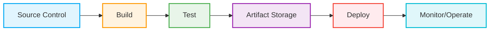
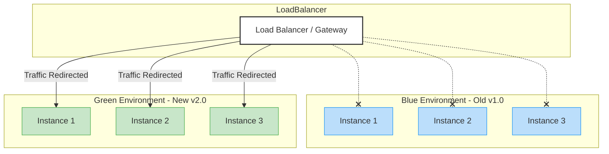

# CI/CD Pipeline in Modern Software Engineering

In the landscape of modern system design and software engineering, building a scalable architecture is only half the battle. Delivering that software reliably, quickly, and securely is equally important. This is where a **CI/CD pipeline** (Continuous Integration and Continuous Delivery/Deployment) becomes essential.

A CI/CD pipeline is an automated workflow that empowers engineering teams to build, test, and deploy applications rapidly and reliably. It serves as the backbone of modern DevOps and Site Reliability Engineering (SRE) practices, effectively replacing error-prone manual deployments with standardized automation.

This chapter breaks down the core objectives, phases, tools, and best practices of establishing world-class CI/CD pipelines.

---

## 1. Core Objectives of CI/CD

Before diving into the mechanics, let us examine the fundamental goals of implementing a CI/CD pipeline:

1. **Automation:** Eliminates repetitive manual tasks throughout the software lifecycle, freeing up developer bandwidth for product innovation.
2. **Consistency:** Provides a repeatable and deterministic deployment mechanism. Code deployed on a Monday behaves exactly identically to code deployed on a Friday, strictly adhering to the defined pipeline steps.
3. **Early Error Detection:** Follows a "fail fast" philosophy. By running unit, integration, and security tests on every commit, developers catch bugs very close to the time they were introduced.
4. **Faster Feedback Loops:** Developers receive validation in minutes rather than days. Context switching is minimized if developers are notified quickly that their latest code push broke a test suite.
5. **Reliability & Low-Risk Releases:** Because code is deployed in smaller, incremental batches, rollbacks become easier and the blast radius of a failing release is contained.

---

## 2. Unpacking "CI" and "CD"

Although commonly lumped together, "CI" and "CD" represent three distinct maturity stages in the software lifecycle.

### 2.1 Continuous Integration (CI)
**Continuous Integration** is the foundational practice of systematically merging source code changes from multiple developers into a single, shared repository (usually the main branch) multiple times a day.

**The Workflow:**
1. Developer writes and commits code.
2. Code is pushed to the Version Control System (VCS), triggering a webhook.
3. A build server compiles or packages the application.
4. Automated tests are strictly executed.
5. If any test fails, the build turns "red," blocking the pull request. Once fixed, it turns "green."

**Benefits:** Eliminates "integration hell" (diverging codebases), enforces code coverage and formatting, and dramatically reduces software defects.

### 2.2 Continuous Delivery vs. Continuous Deployment

Once Continuous Integration successfully results in a tested, immutable artifact (e.g., a Docker container), we enter the "CD" phase.

**Continuous Delivery:**
The software is automatically built, tested, packaged, and strategically released to non-production environments (like Staging or QA). The code is proven to be deployable at any time. However, the final deployment to Production requires **manual approval** (a human button-press).

**Continuous Deployment:**
The ultimate state of DevOps automation. Every single commit that passes all internal automated tests and checks goes straight to **Production** without any manual gatekeeping or human intervention.

> [!NOTE]
> *Continuous Delivery* implies you *can* deploy at any time. *Continuous Deployment* means you *actually do* deploy all the time. Heavily regulated industries (finance, healthcare, banking) typically stop at Continuous Delivery, while consumer-facing tech giants operate in Continuous Deployment.

---

## 3. The Anatomy of a CI/CD Pipeline

To understand a CI/CD pipeline, we must map its sequential stages. A pipeline represents a conveyor belt where raw code goes in, and functional deployments come out.

### Stage 1: Source Control Management (SCM)
Everything begins with a push event, pull request, or merge in a Git repository.
**Key Tools:**
* GitHub
* GitLab
* Bitbucket
* AWS CodeCommit

### Stage 2: The Build
The system fetches the latest code and compiles it into an executable artifact. If it's a Java application, Maven or Gradle creates a `.jar` or `.war` file. If it's a Go binary or a microservice, a Dockerfile is built into a container image.
**Key Tools:**
* Jenkins
* GitHub Actions
* CircleCI
* GitLab CI

### Stage 3: Automated Testing
Running rigorous tests to grant confidence in the artifact.
* **Unit Tests:** Verifying individual functions or classes (e.g., JUnit, Jest, PyTest).
* **Integration Tests:** Ensuring microservices and databases communicate correctly.
* **End-to-End (E2E) Tests:** Simulating real user flows (e.g., Cypress, Selenium, Playwright).
* **Static Application Security Testing (SAST):** Scanning source code for vulnerabilities (e.g., SonarQube).

### Stage 4: Artifact Storage (Registries)
The polished, compiled, and tested output—known as the "Artifact"—must be stored immutably. Once validated, this identical artifact is promoted across subsequent environments. 
**Key Tools:**
* Docker Hub / Amazon ECR / Google GCR (for Docker containers)
* JFrog Artifactory or Sonatype Nexus (for binaries and package dependencies)

### Stage 5: Deployment
Taking the built artifact and booting it up on real infrastructure (Development -> QA -> Staging -> Production).
**Key Tools:**
* Kubernetes (k8s)
* ArgoCD / Flux (GitOps continuous deployment)
* AWS CodeDeploy
* HashiCorp Terraform / Ansible (for provisioning and modifying the underlying infra)

### Stage 6: Monitoring & Observability
Once the code exists in production, you must track its health continuously. If error rates spike, alerting systems page on-call engineers, potentially triggering an automatic rollback.
**Key Tools:**
* Datadog
* Prometheus & Grafana
* ELK Stack (Elasticsearch, Logstash, Kibana)
* PagerDuty

---

## 4. Modern Deployment Strategies

Deploying an application no longer means simply replacing an old file with a new file while users encounter "Scheduled Maintenance" pages. System architects utilize advanced deployment strategies to ensure zero-downtime and safe rollouts.

### 4.1 Rolling Deployments
Old instances (e.g., virtual machines or container pods) are replaced one by one, or in small batches, with the new version.
* **Advantage:** No downtime; system capacity is maintained throughout the update.
* **Disadvantage:** Both new and old code are running simultaneously, potentially causing backward-incompatibility database or API issues.

### 4.2 Blue-Green Deployments
Two completely identical production environments are maintained. "Blue" is currently live with users. The new version is deployed to "Green" (an idle environment). Once QA verifies Green is entirely stable, a load balancer or DNS switch redirects 100% of user traffic from Blue to Green.
* **Advantage:** Immediate, low-risk rollback. Just flip the load balancer switch back to Blue if things go entirely wrong.
* **Disadvantage:** Expensive infrastructure costs. You must temporarily run double the computing footprint.

### 4.3 Canary Deployments
Named after the phrase "canary in the coal mine." The new version is deployed alongside the old version, but only a tiny, controlled fraction (e.g., 5%) of user traffic or requests is routed to it. If the canary system shows no errors and performs nominally, traffic is gradually ramped up to 100%.
* **Advantage:** Limits the "blast radius" to a tiny subset of users. Excellent for observing real production traffic performance before fully committing.

---

## 5. Security in CI/CD (DevSecOps)

Treating security as an afterthought in deployment pipelines leads to potentially catastrophic data breaches. The concept of **DevSecOps** "shifts security left", placing security gating and checks much earlier in the pipeline.

* **Secret Scanning:** Ensuring developers don't accidentally check API keys, database credentials, or AWS tokens into Git (tools: `git-secrets`, TruffleHog).
* **Dependency Scanning:** Checking dependency lists (`package-lock.json`, `pom.xml`, `requirements.txt`) against known CVEs (Common Vulnerabilities and Exposures) to catch compromised open-source packages (e.g., Snyk, Dependabot).
* **Container Scanning:** Before a Docker image can be deployed, it is statically scanned to ensure the base operating system layout has no unpatched zero-days (e.g., Trivy, Clair).
* **Dynamic Application Security Testing (DAST):** Sending simulated attacks (like SQL injection or Cross-Site Scripting (XSS) payloads) against a running staging server to verify defensive posture.

---

## 6. Common Challenges and Best Practices

Implementing CI/CD isn't without hurdles. Long-term success requires engineering discipline.

### Common Pitfalls
* **Slow Pipelines:** If a pipeline takes 45 minutes to run, developers will stop making small, continuous commits, breaking the entire CI philosophy.
* **Flaky Tests:** Tests that arbitrarily fail 10% of the time destroy developer trust. Engineers will begin ignoring test results completely (alert fatigue).
* **Environment Drift:** If the "Staging" configuration begins to differ slightly from "Production", bugs will only present themselves under true load.

### Engineering Best Practices
1. **Always Build Once:** Generate a single immutable Docker image or binary. Pass this identical artifact from Dev → QA → Prod using environment variables to modify database connections or flags. *Never* continuously re-compile or re-build code on its way to production.
2. **Infrastructure as Code (IaC):** Your servers, networks, load balancers, and permissions should be completely defined in code (like HashiCorp Terraform). Provisioning a fresh test environment should happen via automation—not manual, UI-based click-ops.
3. **Use Feature Flags:** Disconnect the act of "deployment" from the act of "release". You can deploy new code to production that is turned entirely off by default, and safely toggle the feature on for users via an external Remote Config tool once you are completely ready.
4. **Fast Feedback Iteration:** Keep unit testing insanely quick (under 3–5 minutes). Postpone heavy, fragile End-To-End (E2E) testing to nightly builds or specific release branch triggers rather than every commit push.

---

## 7. Real-World Architecture: Microservices CI/CD with GitOps

Here is an architectural step-by-step modeling of how a modern, containerized technology company deploys a new feature.

1. A developer pushes a code capability, creating a Pull Request on **GitHub**.
2. **GitHub Actions** immediately intercepts the continuous integration webhook. It runs a `go test` and `golangci-lint` check.
3. With all tests passing green, the developer successfully merges to the main trunk line.
4. GitHub Actions builds a Docker Image and tags it uniquely with the Git commit map SHA (e.g., `api-payment-service:abc123d`).
5. GitHub Actions authenticates securely and pushes the generated image to **AWS Elastic Container Registry (ECR)**.
6. A separate Git repository acting as the "Infrastructure Desired State" automatically receives a bot commit upgrading the image manifest version specifically to `abc123d` in the Kubernetes YAML file.
7. **ArgoCD** (a GitOps operational controller running continuously inside the Kubernetes cluster) actively detects that the Git manifest repository does not match the actual running cluster state footprint. It executes an automated rolling update to securely sync the cluster.
8. **Datadog** (APM) begins granularly measuring the HTTP 500 error rate and latency of the new deployed pods compared to the old, evicted pods.
9. If unhandled exceptions or connection errors begin significantly spiking, ArgoCD initiates an automatic, instantaneous rollback based on predetermined logic checks saving the system.

## 8. Summary

A robust CI/CD pipeline definitively transforms software development from hoping a Friday deployment cycle doesn’t end in an operational disaster, into a boring, heavily automated, and exceptionally low-risk daily ritual. It allows rapid business agility—empowering continuous software iteration and enabling massive engineering organizations to scale deployment frequency enormously while successfully maintaining and isolating system-wide risk.
