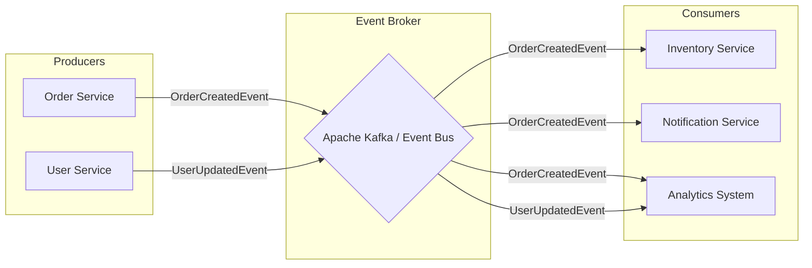

# Event-Driven Architecture Deep Dive

Event-Driven Architecture (EDA) is a software design pattern where decoupled applications asynchronously publish and subscribe to events via an event broker. In modern distributed systems, EDA is a cornerstone for building highly scalable, responsive, and resilient architectures.

Instead of services communicating directly through synchronous requests (like HTTP REST calls), they communicate indirectly by reacting to changes in state—known as "events."

---

## 🏗️ Core Components

A typical event-driven system consists of three main components:

### 1. Event Producers
Producers (or publishers) are the systems or services that generate events. When a significant state change happens (e.g., "User Registered", "Order Placed", "Payment Processed"), the producer creates an event message and drops it into the event broker. Crucially, the producer does not know or care who is listening to the event.

### 2. Event Broker (or Event Bus)
The broker is the middleware that receives events from producers and routes them to the appropriate consumers. It acts as an intermediary, ensuring that messages are reliably delivered. Modern event brokers often provide message persistence, ordered delivery, and stream processing capabilities.
*Examples: Apache Kafka, RabbitMQ, Amazon EventBridge, Google Cloud Pub/Sub.*

### 3. Event Consumers
Consumers (or subscribers) listen to the event broker for specific types of events. When an event arrives, the consumer processes it according to its own business logic. A single event can be consumed by multiple independent services.

---

## 📐 High-Level Architecture Diagram

---

## 🔑 Key Patterns in Event-Driven Systems

### Publish/Subscribe (Pub/Sub)
The most fundamental pattern in EDA. A producer publishes an event to a "topic" or "channel", and all consumers subscribed to that topic receive a copy of the event. This enables a 1-to-many communication model.

### Event Sourcing
Instead of storing just the current state of an entity in a database, Event Sourcing stores **every state change as an immutable event**. The current state is derived by replaying the history of events.
*For example, a bank account balance is calculated by replaying all deposit and withdrawal events rather than just storing the "current balance."*

### CQRS (Command Query Responsibility Segregation)
CQRS separates the data mutation operations (Commands) from the data read operations (Queries). In an event-driven system, commands generate events that update a specialized "write database". These events are then asynchronously propagated to update one or more specialized "read databases" (views), which are optimized for fast querying.

---

## ⚖️ Pros and Cons

### Advantages
- **Loose Coupling:** Producers and consumers are completely independent. You can swap out a consumer without affecting the producer.
- **High Scalability:** Components can scale independently based on the volume of events they need to process.
- **Resilience:** If a consumer goes down, the broker can queue the events. Once the consumer recovers, it can pick up where it left off without data loss.
- **Real-Time Responsiveness:** Ideal for streaming data and building reactive systems that respond to changes immediately.

### Disadvantages
- **Eventual Consistency:** Because events are processed asynchronously, there is a delay before all parts of the system are updated. The system is "eventually" consistent, not "strongly" consistent.
- **Operational Complexity:** Managing event brokers, configuring topics, and monitoring message queues adds significant infrastructure overhead.
- **Complex Debugging:** Tracing a workflow that spans multiple asynchronous events across different services is much harder than following a synchronous HTTP request path. Distributed tracing is essential.
- **Message Ordering and Duplication:** Handling out-of-order events or duplicate deliveries (at-least-once delivery semantics) requires implementing idempotency in consumers.

---

## 🚀 Common Real-World Use Cases

1. **E-Commerce Order Processing:** As seen in the diagram, an `OrderCreated` event can kick off parallel processes for payment processing, inventory reservation, and sending confirmation emails.
2. **Real-Time Analytics:** Streaming user click-stream data or IoT sensor metrics to analytics engines for live dashboards.
3. **Microservices Choreography:** Coordinating complex business transactions across multiple microservices without a central orchestrator.
