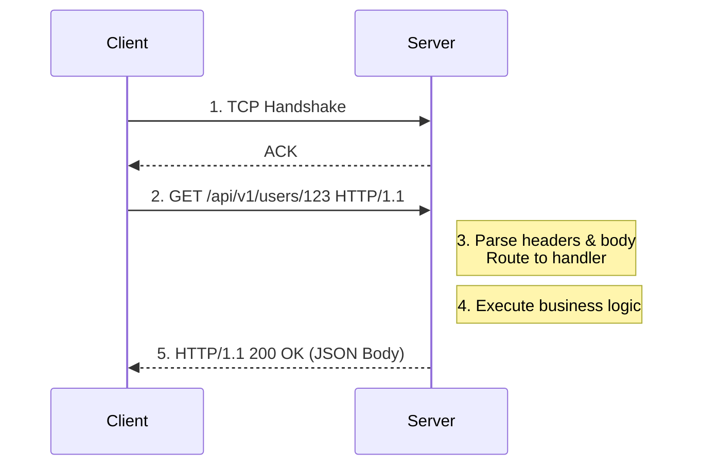
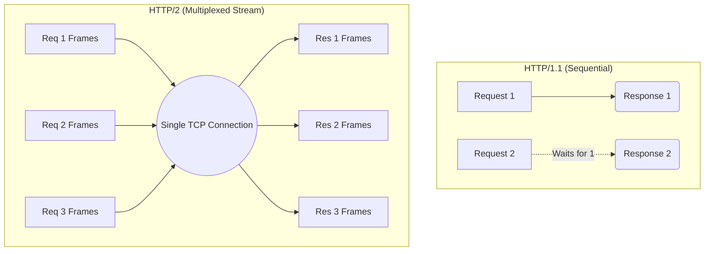
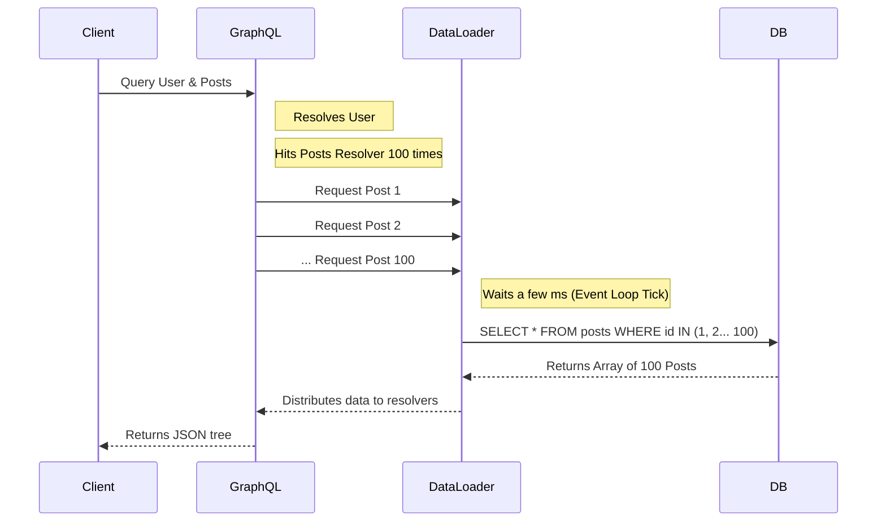

# REST, gRPC, and GraphQL: Protocol Design, Internals, and Trade-offs

## 1. Introduction

Modern distributed systems are fundamentally defined by how their constituent parts communicate. Regardless of how efficiently a microservice processes data internally, the system as a whole is bound by the constraints, overhead, and behavior of the protocols used to exchange that data across the network.

While simple HTTP requests suffice for basic applications, complex, high-throughput systems require careful consideration of communication paradigms. Over time, the industry has rallied around three dominant approaches to API design, each solving distinct problems with different underlying trade-offs:

1. **REST (Representational State Transfer):** The standard bearer for resource-oriented architecture, relying on standard HTTP semantics.
2. **gRPC (gRPC Remote Procedure Calls):** A high-performance, binary protocol built on HTTP/2, prioritizing efficiency and strict typing.
3. **GraphQL:** A flexible, client-driven query language allowing consumers to request exactly the data they need from a single endpoint.

While they appear similar at a surface level, as they all facilitate client-server communication, they differ fundamentally in their transport behavior, serialization formats, execution models, performance characteristics, and operational complexity. This chapter provides a textbook-level deep dive into these paradigms.

---

## 2. REST (Representational State Transfer)

### 2.1 Conceptual Model

Introduced by Roy Fielding in 2000, REST is an architectural style rather than a strict protocol. It is deeply intertwined with the mechanics of HTTP. REST models a system as a collection of **resources** (e.g., users, orders, products) identified by clean URLs. Manipulation of these resources is performed strictly via standard HTTP verbs (GET, POST, PUT, PATCH, DELETE).

Example:
- `GET /users/123` retrieves the state of user 123.
- `POST /orders` creates a new order resource.

REST relies on hypermedia and resource representations to decouple the client from the internal state of the server.

---

### 2.2 Internal Mechanics

#### 2.2.1 The HTTP/1.1 Request Lifecycle

In a standard REST over HTTP/1.1 architecture, the interaction lifecycle follows a text-based, sequential model:

1. **Connection Establishment:** The client opens a TCP connection (and performs a TLS handshake for HTTPS).
2. **Request Transmission:** The client sends an HTTP request formatted as plain text (headers, method, URL, and an optional body).
3. **Processing:** The server parses the headers and body, routes the request to the appropriate application handler, and executes the business logic.
4. **Response Generation:** The server generates an HTTP response (status code, headers, and body).
5. **Response Transmission:** The response is sent back over the wire.



**Key Limitation: Head-of-Line Blocking**
HTTP/1.1 suffers from connection-level head-of-line (HOL) blocking. While a connection is open, requests must be served sequentially. If one request takes a long time, subsequent requests on the same connection are blocked. To bypass this, clients traditionally open multiple parallel TCP connections (typically capped at 6 per origin by browsers).

#### 2.2.2 Serialization: The Cost of JSON

REST almost ubiquitously uses **JSON (JavaScript Object Notation)** as its data serialization format. 

* **Advantages:** JSON is human-readable, widely understood, and native to web browsers. Debugging a JSON payload simply involves looking at the raw text.
* **Costs:** JSON is a text-based format. This introduces significant **parsing overhead** on the CPU, as the server must convert strings into in-memory objects and type-check dynamically. Additionally, the **payload size** is larger compared to binary formats due to repetitive keys and whitespace.

#### 2.2.3 Statelessness and Scalability

A fundamental constraint of REST is statelessness. Each request from client to server must contain all of the information necessary to understand the request, and cannot take advantage of any stored context on the server.

* **Implication:** Because no session state is kept on the server, horizontally scaling the backend is remarkably straightforward. Any instance of the service can handle any request, eliminating the need for sticky sessions.

#### 2.2.4 The Caching Layer

REST's true superpower lies in its native utilization of the HTTP caching specification. Because operations are standardized (e.g., `GET` is idempotent and safe), intermediate layers (CDNs, load balancers, browser caches) can aggressively cache responses based on headers:

* `Cache-Control`: Defines caching policies (e.g., `max-age`).
* `ETag`: Provides a validation token to conditionally fetch data if it has changed.
* `Last-Modified`: Uses timestamps to validate freshness.

This enables massive scale for read-heavy workloads by offloading requests entirely from the backend infrastructure.

---

### 2.3 Hidden Real-World Behavior

In production environments, REST reveals several practical realities:
* **CPU Bottlenecks:** Under extreme load, JSON serialization/deserialization often becomes the primary CPU bottleneck, more so than actual business logic.
* **The "RPC in REST Clothing" Anti-Pattern:** Many APIs claim to be RESTful but are actually RPC systems using HTTP methods haphazardly (e.g., using `POST /users/123/activate` instead of updating the user resource state).
* **Over-fetching and Under-fetching:** REST endpoints return fixed data structures. Clients often receive more data than they need (over-fetching) or have to make multiple subsequent requests to get related entities (under-fetching), leading to chatty networks where latency dominates.

---

## 3. gRPC (High-Performance RPC Framework)

### 3.1 Conceptual Model

Developed by Google, gRPC is an implementation of the **Remote Procedure Call (RPC)** pattern. The conceptual model shifts away from manipulating "resources" and instead focuses on invoking "actions". 
> *Call a function on a remote machine exactly as if it were a local function call.*

Clients use a generated stub that provides an identical interface to the server's implementation.

---

### 3.2 Core Technologies

gRPC derives its performance from two foundational technologies:
1. **HTTP/2** for the transport layer.
2. **Protocol Buffers (Protobuf)** for interface definition and data serialization.

---

### 3.3 Internal Mechanics

#### 3.3.1 HTTP/2 Multiplexing

Unlike HTTP/1.1's sequential nature, HTTP/2 is built around **multiplexing**. Multiple concurrent requests and responses can share a single, long-lived TCP connection. 

Each request/response pair is assigned a unique Stream ID. Data is sent concurrently as interleaved chunks.



**Result:** Head-of-line blocking is eliminated at the HTTP layer, connection reuse is highly efficient, and TCP connection overhead (handshakes, slow start) is amortized.

#### 3.3.2 Binary Framing

HTTP/2 replaces plain text headers and bodies with a binary framing mechanism. Data is split into distinct frames (e.g., `HEADERS` frame, `DATA` frame). This allows for highly efficient machine parsing and native header compression (HPACK).

#### 3.3.3 Protocol Buffers (Protobuf)

Protobuf is a strongly typed, binary serialization format. Developers define their data structures and service interfaces in a `.proto` file. The gRPC compiler then generates native client and server code in multiple languages.

* **Advantages:** The binary format is incredibly compact, drastically reducing payload size over the wire. Encoding and decoding are exceptionally fast CPU-wise because fields are accessed by numeric tags rather than string keys.
* **Trade-off:** The payload is not human-readable. You cannot simply `curl` a gRPC endpoint and read the response. It requires the schema definition to decode, demanding strict schema management and versioning disciplines.

#### 3.3.4 Streaming (Key Strength)

Because it utilizes HTTP/2 streams natively, gRPC supports four communication patterns:
1. **Unary:** Standard request-response.
2. **Server Streaming:** Client sends one request, server responds with a stream of messages (e.g., live stock ticker).
3. **Client Streaming:** Client sends a stream of messages, server responds once.
4. **Bidirectional Streaming:** Both sides send a stream of messages independently (e.g., real-time multiplayer gaming state or chat).

---

### 3.4 Execution Flow

1. The client application calls a local method on the generated Stub.
2. The Stub serializes the strongly-typed parameters into binary Protobuf format.
3. The serialized bytes are sent over an HTTP/2 stream.
4. The server's gRPC framework receives and reassembles the frames, deserializing the Protobuf.
5. The server executes the actual underlying function.
6. The response follows the reverse path.

---

### 3.5 Hidden Real-World Behavior

* **Latency Reduction:** The combination of binary serialization and long-lived HTTP/2 connections reduces tail latency significantly.
* **Cold Starts:** Connection warm-up matters. The initial request on a new gRPC connection incurs the TCP and TLS handshake penalties. Keeping connections alive is crucial.
* **Load Balancing Challenges:** Because gRPC relies on long-lived connections, traditional L4 (Transport Layer) load balancing causes uneven load distribution. gRPC requires L7 (Application Layer) load balancing that understands HTTP/2 streams to distribute individual requests, not just connections.
* **Backpressure:** In streaming systems, managing backpressure (when the sender is faster than the receiver) is critical to prevent memory exhaustion.

---

## 4. GraphQL

### 4.1 Conceptual Model

Developed by Facebook, GraphQL flips the control dynamics of API design. Instead of the server defining fixed endpoints that return fixed data structures (REST), GraphQL provides a **single endpoint** (usually `POST /graphql`). It serves as a **query language for APIs**.

The client sends a query specifying the exact schema and shape of the data it requires, and the server returns a response mirroring that shape.

---

### 4.2 Internal Execution Model

Unlike REST or gRPC which map closely to network transport layers, GraphQL is fundamentally a **query execution engine**. It operates primarily as an orchestration layer above your data sources.

#### 4.2.1 Query Parsing and AST

1. A raw query string is received by the server.
2. The GraphQL engine parses this string, performing lexical analysis to generate an **Abstract Syntax Tree (AST)**.

#### 4.2.2 Validation

The engine traverses the AST and validates it against the strongly-typed GraphQL schema defined on the server. It checks if the requested fields exist, if arguments are valid, and if the client has authorization.

#### 4.2.3 Execution Engine (Recursive Resolution)

GraphQL resolves data field by field, operating recursively.

Consider this query:
```graphql
query {
  user(id: "123") {
    name
    posts {
      title
    }
  }
}
```

The execution flows systematically:
1. Resolve the top-level `user` field.
2. Pass the resolved user object to the next level.
3. Resolve the scalar `name` field.
4. Resolve the `posts` array for that user.
5. For each post in the array, resolve the `title` field.

#### 4.2.4 Resolver Functions

Behind the scenes, every field in a GraphQL schema is backed by a **Resolver** function. A resolver's job is simply to fetch the data for that specific field. Resolvers can fetch from a database, call an internal gRPC service, or hit a third-party REST API. This makes GraphQL an excellent API Gateway technology.

---

### 4.3 The N+1 Query Problem

GraphQL's recursive, field-level execution model introduces a notorious performance bottleneck: the **N+1 Query Problem**.

#### The Problem
When querying nested relationships (like a user and their posts), the execution engine calls the resolver for the parent once, and then calls the resolver for the child for *every* item returned by the parent.

* Fetch 1 user (1 DB query).
* User has 100 posts.
* The `posts` resolver triggers 100 separate DB queries to fetch the title for each post.
* Total queries: 1 (for parent) + N (for children) = N+1.

#### The Solution: DataLoader
The industry standard solution is the **DataLoader** pattern. It intercepts resolver calls, batches identical requests (e.g., gathering all requested Post IDs), and dispatches a single batched query to the database (`SELECT * FROM posts WHERE id IN (...)`).



---

### 4.4 Transport Layer

GraphQL is transport agnostic but practically runs over HTTP/1.1 or HTTP/2, using a single `POST` endpoint with the query embedded in the JSON body. The response is also JSON.

---

### 4.5 Hidden Real-World Behavior

* **CPU Heavy:** The parsing, AST generation, validation, and recursive resolution make GraphQL heavily CPU-bound compared to the lightweight routing of REST.
* **Query Complexity and DOS Attacks:** Because clients dictate the query, a malicious or poorly designed client can request an infinitely deeply nested query, crushing the server. Production GraphQL APIs require strict **query cost analysis**, depth limiting, and rate limiting.
* **Caching is Hard:** Because everything is a `POST` to a single endpoint, standard HTTP-level caching (like CDNs) is completely ineffective. Caching must be implemented at the application level (e.g., using Apollo Server's cache layers or persistent queries).

---

## 5. Deep Comparison (Beyond Surface Level)

| Dimension | REST | gRPC | GraphQL |
| :--- | :--- | :--- | :--- |
| **Protocol Foundation** | HTTP/1.1 (Standard) | HTTP/2 (Required) | Any (Usually HTTP/1.1 POST) |
| **Data Format** | JSON (Text) | Protobuf (Binary) | JSON (Text) |
| **Latency** | Medium (Text parsing, HOL blocking) | Low (Binary, Multiplexed) | Medium–High (Heavy processing overhead) |
| **Payload Size** | Large (Verbose keys, whitespace) | Small (Highly compressed) | Medium (Client filters unused fields) |
| **Streaming Support** | Limited (SSE/WebSockets needed) | Native (Bidirectional streams) | Limited (Subscriptions via WebSockets) |
| **Client Flexibility** | Low (Server defines structure) | Low (Strict contract) | High (Client defines structure) |
| **Backend Complexity** | Low | Medium (Schema tooling, L7 routing) | High (Resolvers, N+1, Security) |
| **Caching** | Native HTTP/CDN | Application Level | Application Level |
| **Debugging** | Easy (cURL, Network Tab) | Hard (Requires tooling/proxies) | Medium (Great IDEs, but complex execution) |

---

## 6. When to Use What (Real Insight)

Selecting the right protocol is rarely about finding the objective "best," but rather aligning the tool with the system's boundary conditions.

### Use REST when:
* Building **Public APIs** intended for massive external integration (Stripe, Twilio). The simplicity and ubiquity of HTTP semantics lower the barrier to entry for third-party developers.
* **Aggressive caching** is critical. If your application is highly read-heavy and data is public (e.g., a news site), CDN caching via REST is unbeatable.
* Simplicity and developer onboarding speed are priorities.

### Use gRPC when:
* Building **Internal Microservices**. When you control both the client and the server, the strict contracts and binary efficiency of gRPC provide immense performance benefits at scale.
* **Low latency and high throughput** are mandatory (e.g., financial trading engines, real-time ad bidding).
* The application requires **streaming data** natively (e.g., sensor telemetry, continuous location updates).
* Implementing polyglot environments where different services are written in Go, Java, Python, etc.

### Use GraphQL when:
* **Frontend flexibility** is paramount. If you have multiple clients (Web, iOS, Android, SmartWatch) that require vastly different shapes of data from the same domain.
* You need an **API Gateway / Backend-For-Frontend (BFF)** pattern. GraphQL excels at orchestrating and aggregating data from multiple underlying REST APIs or microservices into a single query.
* You suffer from severe network bandwidth constraints on mobile devices, making over-fetching unacceptable.

---

## 7. Hybrid Architectures (Production Reality)

Real, mature systems rarely dogmatically adhere to a single paradigm. The most robust architectural pattern in modern enterprise design involves combining these protocols to exploit their respective strengths.

**The Typical Enterprise Pattern:**
* **Edge / External Layer:** Uses **GraphQL** to provide flexible, dynamic data aggregation for varied frontend clients, or **REST** for simple third-party webhooks.
* **Internal Inter-Service Layer:** Uses **gRPC** for high-speed, type-safe, binary communication between internal microservices.

```mermaid
graph LR
    subgraph "External Clients"
        Web[Web Frontend]
        Mobile[Mobile App]
    end
    
    subgraph "API Gateway Layer"
        GQL[GraphQL Server / BFF]
    end
    
    subgraph "Internal Microservices"
        Auth[Auth Service (gRPC)]
        User[User Service (gRPC)]
        Order[Order Service (gRPC)]
    end
    
    Web -- "HTTP POST (GraphQL Query)" --> GQL
    Mobile -- "HTTP POST (GraphQL Query)" --> GQL
    
    GQL -- "Binary Protobuf (HTTP/2)" --> Auth
    GQL -- "Binary Protobuf (HTTP/2)" --> User
    GQL -- "Binary Protobuf (HTTP/2)" --> Order
```

In this architecture, the Frontend dictates what data it needs. The GraphQL layer handles the parsing, authentication, and execution planning. The resolvers in the GraphQL layer then act as gRPC clients, firing off high-speed binary requests to the backend microservices, aggregating the responses, and returning a unified JSON payload to the user.

---

## 8. Performance Insights

When profiling distributed systems, understanding *where* time is spent is critical.

### Network vs CPU Trade-off
* **REST** is primarily bound by network throughput and I/O due to its chatty nature and large JSON payloads.
* **gRPC** minimizes network payload and serialization time, shifting the bottleneck to actual business logic. It is highly CPU efficient during serialization.
* **GraphQL** minimizes network overhead by preventing over-fetching, but is heavily CPU-bound on the server due to parsing the AST and resolving fields dynamically.

### Latency Composition
`Total Latency = Network Latency + Serialization/Deserialization Cost + Processing Time`

* **gRPC minimizes the first two variables.** It shrinks the payload over the wire and optimizes encoding/decoding, leading to the lowest overall latency.
* **GraphQL increases processing time** but may reduce overall network latency from the client's perspective by eliminating the need for multiple round-trip requests (under-fetching).

---

## 9. Conclusion

REST, gRPC, and GraphQL represent fundamentally different approaches to API design, each engineered to solve specific constraints:

* **REST** emphasizes simplicity, standardization, and leverages the underlying architecture of the web (caching, URIs).
* **gRPC** emphasizes raw performance, strict contracts, and network efficiency.
* **GraphQL** emphasizes developer experience, client flexibility, and optimized data aggregation.

Choosing the right approach depends on system requirements, team expertise, and operational constraints. In practice, the most scalable and maintainable architectures combine these paradigms, using GraphQL at the edge for flexibility and gRPC internally for performance.
