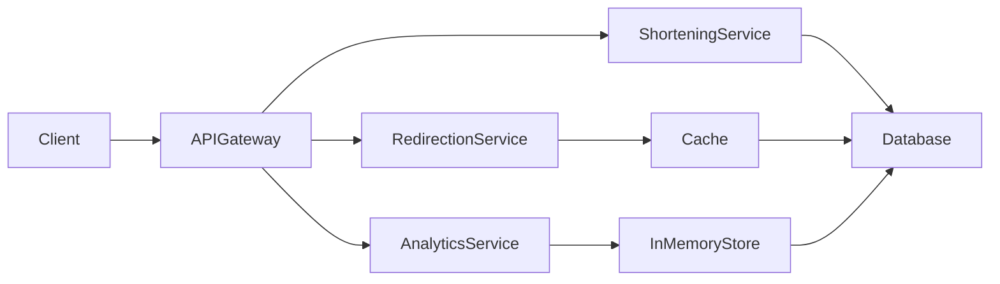
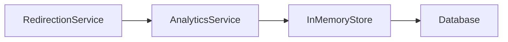

# Design a URL Shortener (like Bitly)

A beginner-friendly but highly instructive system design problem.

---

# 1. Requirements

## 1.1 Functional Requirements

1. **Shorten a long URL**
   - Input: Long URL
   - Output: Unique short URL
   - One-to-one mapping

2. **Redirect short URL → long URL**
   - User visits short URL
   - System returns HTTP redirect (302 preferred)

3. **Link Analytics**
   - Track number of times each short URL is accessed

---

## 1.2 Non-Functional Requirements

| Requirement | Target |
|-------------|--------|
| Daily Active Users | ~100M |
| Reads per day | ~1B |
| Writes per day | Millions |
| Total URLs stored | 1–5 Billion |
| Redirect Latency | Very Low |
| Availability | 99.9%+ |

### Traffic Estimation

```
1B reads/day ÷ 100,000 seconds/day ≈ 10,000 RPS
```

Expect possible spikes → 100K RPS.

---

# 2. API Design

## 2.1 Create Short URL

```
POST /api/urls/shorten
```

### Request
```json
{
  "long_url": "https://example.com/very/long/url"
}
```

### Response
```json
{
  "short_url": "https://bit.ly/abc123"
}
```

---

## 2.2 Redirect

```
GET /api/urls/{short_url}
```

### Response
- HTTP 302 Redirect → Long URL

### Why 302 (Not 301)?

- 301 → Browser caches redirect
- 302 → Every request hits server
- Needed for accurate analytics

---

# 3. Database Design

## URL Table

| Field        | Type      |
|--------------|-----------|
| short_url    | string (PK) |
| long_url     | string |
| user_id      | string |
| created_at   | datetime |
| usage_count  | integer |

### Storage Estimate

- Assume 1 KB per record
- 1B URLs → ~1 TB storage
- Single DB node feasible initially

---

# 4. High-Level Architecture

## 4.1 Basic Version


Works functionally but does not scale.

---

## 4.2 Scalable Version (Microservices + Gateway)



---

# 5. URL Shortening Strategy

We need unique 6–8 character strings.

## Character Set: Base62

- a–z (26)
- A–Z (26)
- 0–9 (10)

Total: 62 characters

### Capacity

```
62^6 ≈ 56 Billion
62^7 ≈ 3.5 Trillion
```

6–7 chars sufficient.

---

## Option 1: Counter-Based (Using Redis)

### Flow

1. Increment counter
2. Convert counter → Base62
3. Store in DB

### Pros
- Guaranteed uniqueness
- Fast

### Cons
- Single point of failure
- Needs Redis replication strategy

---

## Option 2: Random + Retry

1. Generate random 6–7 char string
2. Check DB for collision
3. Retry if exists

### Collision Probability
Extremely low with trillions of combinations.

### Pros
- Simple
- No central counter
- Horizontally scalable

### Cons
- Rare retry latency

---

## Option 3: Hash-Based (Recommended)

1. Hash long URL (MD5/SHA-256)
2. Take first 6–7 chars
3. Retry on collision

### Why Good?
- Deterministic
- Scalable
- No shared counter
- Clean design

---

# 6. Redirection Optimization

At 10K+ RPS, direct DB reads are expensive.

## Add Cache (Redis)


### Flow

1. Check cache
2. If hit → return
3. If miss → query DB
4. Populate cache

### Benefits

- Lower latency
- Higher throughput
- Offloads DB
- Handles traffic spikes

---

# 7. Analytics Design

We must increment usage count on each redirect.

## Problem
Updating DB on every redirect = high write load.

## Solution: In-Memory Aggregation



### Flow

1. Increment count in memory
2. Periodically flush to DB (e.g., every 60 seconds)

### Tradeoff

- Lose up to 60 seconds of data if crash
- Much better performance

---

# 8. Scaling Strategies

| Problem | Solution |
|----------|----------|
| High Reads | Cache |
| DB Bottleneck | Read Replicas |
| Massive Data | Sharding |
| Analytics Writes | Batch flush |
| Service Failures | Replication |
| Latency | Memory over disk |

---

# 9. Design Tradeoffs

| Design Choice | Why |
|---------------|-----|
| 302 Redirect | Accurate analytics |
| Cache over Read Replicas | Faster & simpler |
| Hash-based short URL | No single point of failure |
| Batch analytics flush | Avoid write amplification |
| Base62 | Human-readable URLs |

---

# 10. Final Architecture Summary


---

# Interview Strategy Notes

- Start with requirements
- Estimate traffic early
- Justify tradeoffs
- Prefer simple solutions
- Optimize only when necessary
- Explain why something is overkill

---

# Key Takeaways

- System design is about tradeoffs.
- Scale drives architecture decisions.
- Reads dominate writes.
- Cache is your best friend.
- Simplicity wins unless scale demands complexity.

---

# If Asked "How Would You Improve Further?"

- Add CDN layer
- Add rate limiting at API gateway
- Add multi-region replication
- Add custom URLs
- Add expiration support
- Add abuse detection

---

# Conclusion

A URL shortener looks simple, but:

- Traffic estimation
- Caching strategy
- URL generation logic
- Analytics batching
- Failure handling

These are what make it a strong system design interview problem.
